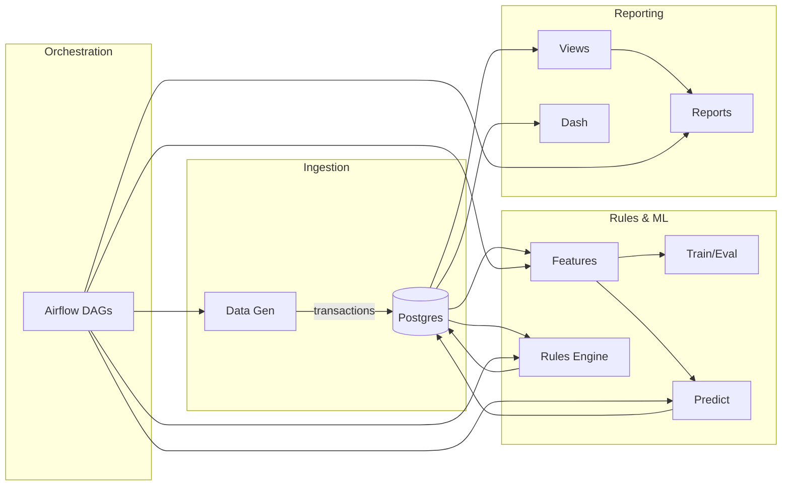

# Enterprise Fraud Monitoring Solution(End-to-End Fraud Detection & Analytics)

An end-to-end, local-first fraud analytics system: synthetic transaction generation, YAML-driven rules, ML scoring, reporting, an Airflow-powered daily pipeline, and a Plotly Dash dashboard. Designed for quick evaluation and realistic demos with PostgreSQL 15 and Python 3.11.

## Highlights
- PostgreSQL schema for `accounts`, `cards`, `merchants`, `transactions`, `labels`, `alerts`, `rules`, `model_scores`.
- Synthetic but realistic data using Faker with controllable fraud patterns.
- YAML-driven rules engine (high-value, rapid-fire, geo-velocity, merchant risk, night-owl CNP).
- ML pipeline (Logistic Regression, Random Forest, optional XGBoost) with metrics and plots.
- Airflow DAGs for daily flows; CLI fallback for direct runs.
- Plotly Dash dashboard with KPIs, trends, drill-downs.
- pytest suite for data generation, rules, and ML smoke.

## Architecture

## Prerequisites
- Option A (Docker): Docker Desktop 4.x or newer.
- Option B (No Docker): Python 3.11, PostgreSQL 15, `make`, and a local `psql` client.

## Quickstart (Docker)
1. `git clone <this-repo>`
2. `cd fraud-e2e`
3. `cp .env.example .env`
4. `docker compose up -d db`
5. `make airflow-init`
6. `docker compose up -d`
7. `make seed`
8. `make gen DAYS=14`
9. `make features`
10. `make train ALGO=rf`
11. `make predict`
12. `make dashboard`

Airflow UI: http://localhost:8080 (user: `airflow`, pass: `airflow`)
Dashboard: http://localhost:8050

## Quickstart (No Docker)
- Setup venv and deps:
  - `python3.11 -m venv .venv && source .venv/bin/activate` (Windows: `.venv\\Scripts\\activate`)
  - `pip install -r requirements.txt`
- Create database and schema:
  - Ensure Postgres running locally with a database matching `.env.example` or your overrides
  - `psql -h localhost -U postgres -c "CREATE DATABASE fraude2e;"`
  - `psql -h localhost -U postgres -d fraude2e -f db/init.sql`
  - `psql -h localhost -U postgres -d fraude2e -f db/views.sql`
  - `psql -h localhost -U postgres -d fraude2e -f db/stored_procs.sql`
- Seed and generate:
  - `python -m src.cli seed`
  - `python -m src.cli generate --days 14 --tx-per-day 20000`
- Build features and train:
  - `python -m src.cli features`
  - `python -m src.cli trainsklearn --algo rf`
  - `python -m src.cli predict`
- Launch dashboard:
  - `python dashboard/app.py`

## Configuration Guide
- `config/settings.yaml`: DB connection, batch sizes, thresholds, dashboard port, seed, timezone.
- `config/rules.yaml`: Add/edit rules. Each rule has `name`, `description`, `active`, and `params`.
- `config/model.yaml`: Feature list, target, split strategy, algo params. Switch algos via CLI or by editing params.

## Rules Engine
- Pre-deploy tests: `python -m src.rules.tests_predeploy`
- Post-deploy tests: run after a day’s data exists: `python -m src.rules.tests_postdeploy`
- Apply rules and write alerts: `python -m src.cli rulescore`

## ML Pipeline
- Train: `python -m src.cli trainsklearn --algo lr|rf|xgb`
- Evaluate: `python -m src.cli evaluate`
- Predict: `python -m src.cli predict`
- Metrics, plots under `artifacts/`.

## Airflow
- Initialize: `make airflow-init`
- Bring up webserver/scheduler: `docker compose up -d`
- Access UI at http://localhost:8080
- DAGs:
  - `fraud_daily_dag`: end-to-end daily pipeline
  - `backfill_transactions_dag`: generate historical data

## Dashboard
- Start: `python dashboard/app.py` (port from `config/settings.yaml`)
- Features: KPIs, trends, model distributions, flagged transactions table with drill-down.

## Data Governance & Caveats
- All data is synthetic and for demo use only. Do not mix with real PII/PAN. The system avoids storing raw PAN; cards only contain `pan_last4`.

## Video Walkthrough Script (3–5 mins)
1. Open README & show architecture diagram; highlight DB, rules, ML, Airflow, dashboard.
2. Show `config/settings.yaml` and `config/rules.yaml`—explain YAML-driven behavior.
3. Run `make gen` to create synthetic transactions; show DB tables in `psql`.
4. Run `make features`—explain key features (recency/frequency, rolling stats).
5. Run `make train ALGO=rf`—show artifacts saved, metrics summary.
6. Run `make predict`—explain model_scores table.
7. Run `make rules` to score YAML rules; open alerts table.
8. Open `dashboard/app.py`—show KPIs, trends, and suspicious transactions drill-down.
9. Open Airflow UI; trigger `fraud_daily_dag`; step through tasks.
10. Discuss Ops handoff (ROLEPLAY): how alerts flow to Fraud Ops and feedback to training.

---

See Makefile for handy targets; tests via `make test`.
